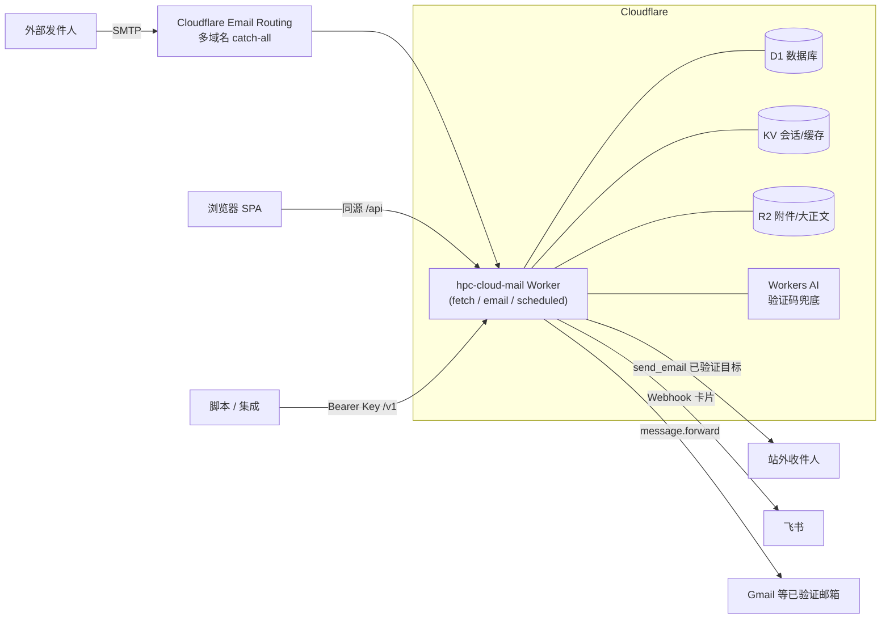

<div align="center">


# HPC Mail

**基于 Cloudflare Workers 的多域名多用户邮箱系统**

无需传统邮件服务器 · 任意前缀 catch-all 收件 · 验证码自动提取 · 开放 REST API

[](https://github.com/riba2534/hpc-mail/actions/workflows/deploy.yml)
[](LICENSE)
[](https://workers.cloudflare.com/)
[](https://react.dev/)
[](https://www.typescriptlang.org/)
[](https://hono.dev/)
[](https://pnpm.io/)

</div>

---

## ✨ 功能特性

- **多域名 catch-all 收件**——任意前缀发到任何已接入域名的邮件全部落库，无需预建地址
- **多用户体系**——管理员看全站邮件与系统配置；普通用户认领地址后使用，地址全局唯一占用，认领即可见该地址全部历史邮件
- **统一收件箱**——全域名邮件混排，按域名 / 邮箱地址 / 已读未读 / 星标 / 关键词（含正文）过滤，全部状态同步到 URL
- **验证码自动提取**——正则同步提取 + Workers AI 兜底，列表角标与详情高亮一键复制，接码场景开箱即用
- **完整收发**——回复（In-Reply-To/References 线程化）、转发、CC/BCC、附件；外发走 Cloudflare `send_email`（仅限 Email Routing 已验证目标地址），站内互投即时送达
- **通知与转发**——收件推送飞书 Webhook 卡片（HMAC 签名 + 防 SSRF），可自动转发到 Gmail 等已验证邮箱
- **开放 REST API**——`/v1` 全套接口（收件箱 / 详情 / 附件 / 发件 / 邮箱管理），API Key 支持 scope、每分钟限流、IP 白名单、过期时间与调用审计
- **注册模式可配**——关闭（默认）/ 邀请码 / 开放注册，管理后台一键切换
- **动态域名管理**——收件域名完全由管理员在后台「域名」页维护（增删即时生效），不写死在部署配置里，加域名无需重新部署
- **浅色现代 UI**——Graphite + Indigo 设计系统，桌面 / 平板 / 移动三档响应式

## 🏗 架构



单个 Worker 同时承载三种入口：`fetch`（API + 前端静态资源）、`email`（收件处理）、`scheduled`（每日清理）。前端构建产物直接打进 Worker Assets，同源部署零跨域。

## 🧰 技术栈

| 层 | 技术 |
|---|---|
| 后端 | Cloudflare Workers · Hono 4 · Drizzle ORM（D1/SQLite，增量迁移）· PostalMime |
| 前端 | React 19 · Vite · Tailwind CSS 4 · TanStack Query 5 · React Router 7 · Radix Primitives |
| 契约 | pnpm workspace monorepo，`packages/shared` 提供前后端共享的 zod schema 与类型 |
| 存储 | D1（业务数据）· KV（会话/配置缓存）· R2（附件与超大正文） |
| CI/CD | GitHub Actions：测试门控 → 构建 → 迁移 → 部署 → 迁移完整性校验 → 线上冒烟 |

## 📁 目录结构

```text
hpc-mail/
├─ packages/shared/     # zod 契约：请求/响应 schema、常量、错误码
├─ apps/worker/         # Cloudflare Worker 后端
│  ├─ src/routes/       #   /api 内部接口 + /v1 开放接口
│  ├─ src/services/     #   收发件、认领、设置、飞书、验证码提取
│  ├─ migrations/       #   drizzle 增量迁移（wrangler d1 migrations apply）
│  └─ fixtures/         #   本地收信模拟用 .eml 样例
├─ apps/web/            # React SPA（构建产物打进 Worker Assets）
│  └─ src/features/     #   inbox / message / compose / mailboxes / admin ...
├─ docs/DESIGN.md       # 设计基线（色彩令牌 / 组件 / 反模式）
└─ .github/workflows/   # deploy.yml 一条流水线
```

## 🚀 快速开始

### 本地开发

```bash
pnpm install
cp apps/worker/.dev.vars.example apps/worker/.dev.vars   # 填 jwt_secret
pnpm --filter @hpc-mail/worker db:migrate:local          # 初始化本地 D1
node apps/worker/scripts/seed-admin.mjs --local          # 引导本地管理员（需 ADMIN_USERNAME/ADMIN_PASSWORD 环境变量）
pnpm dev                                                 # worker :8787 + web :3002
```

本地无需真实收信，用内置脚本注入一封邮件：

```bash
apps/worker/scripts/dev-send-mail.sh otp-plain hello@hpc.email
```

> 注意：`wrangler dev` 依赖 workerd，宿主机需要 glibc ≥ 2.32（Ubuntu 22.04+）。

### 部署到 Cloudflare

1. 准备资源：D1 数据库、KV 命名空间、R2 存储桶，改 `apps/worker/wrangler.toml` 中的资源 ID。域名**不写死在配置里**——部署上线后，管理员在后台「域名」页把已开启 Email Routing catch-all 的域名逐个添加即可（见下方「动态域名管理」）
2. 配置 GitHub 仓库 Secrets / Variables：

   | 类型 | 名称 | 说明 |
   |---|---|---|
   | Secret | `CLOUDFLARE_API_TOKEN` | 具备 Workers/D1/KV 权限 |
   | Secret | `JWT_SECRET` | ≥43 位 URL-safe 随机串 |
   | Secret | `ADMIN_PASSWORD` | 管理员密码（12–128 位） |
   | Variable | `ADMIN_USERNAME` | 管理员用户名 |
   | Variable | `CUSTOM_DOMAIN` | 控制台域名（冒烟用） |

3. push 到 `main` 自动部署；首次上线用 workflow_dispatch 勾选 `reset_database` 清库重建

## 🔌 开放 API 速览

在网页「API Keys」页创建密钥（明文仅展示一次），即可用脚本收发邮件：

```bash
BASE=https://your-domain.example
KEY=hpcm_xxxxxxxx...

# 拉取最新收件（含自动提取的验证码字段 verificationCode）
curl -s "$BASE/v1/messages?limit=10&domain=example.com" -H "Authorization: Bearer $KEY"

# 发一封邮件
curl -s -X POST "$BASE/v1/messages" \
  -H "Authorization: Bearer $KEY" -H "Content-Type: application/json" \
  -d '{"from":{"localPart":"noreply","domain":"example.com"},"to":["someone@example.org"],"subject":"Hello","text":"来自 HPC Mail 的邮件"}'
```

全部端点：`GET /v1/status` · `GET /v1/domains` · `GET|POST /v1/mailboxes` · `GET|POST /v1/messages` · `GET /v1/messages/:id` · `GET /v1/messages/:id/attachments/:attId`。scope 粒度：`mail.read` / `mail.send` / `mailbox.read` / `mailbox.write`。

## ⚙️ 设置：系统级 vs 个人级

**归属模型三层**：域名（默认仅管理员，可开放给普通用户）→ 地址（已认领 / 未认领，未认领归管理员）→ 收件后按归属人的个人配置处理。

- **系统设置**（管理后台，仅管理员，全局生效）：注册模式、收件域名列表（含公开开关与每域每人认领上限）、验证码提取开关（正则 / AI）、邮件保留策略、外发配额、认领策略、强制 2FA、站点标题、开放 API 总开关。
- **个人设置**（`/profile`，每个用户配自己的）：头像、密码、两步验证，以及**转发与通知**——把自己认领地址收到的邮件转发到自己的飞书 Webhook、通用 Webhook（Bark / ntfy / 自建）或外部邮箱。管理员的这份配置还作用于未认领地址与系统通知。外部邮箱转发受 Cloudflare 硬限制（目标须为 Email Routing 已验证 destination）。

## 📄 License

[MIT](LICENSE) © riba2534
