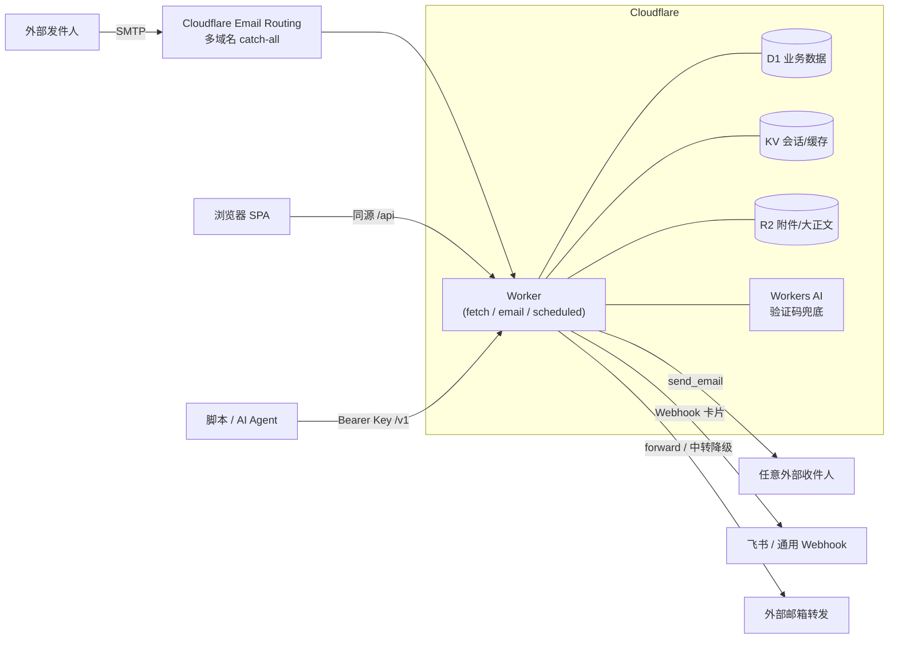

<p align="center">
  
</p>

<h1 align="center">HPC Mail</h1>

<p align="center">
  <b>基于 Cloudflare Workers 的多域名多用户邮箱系统</b>
  <br />
  不需要传统邮件服务器：Email Routing 收件 + Workers 处理 + D1/KV/R2 存储，push 到 main 即自动部署。
</p>

<p align="center">
  <a href="https://github.com/riba2534/hpc-mail/actions/workflows/deploy.yml"></a>
  <a href="https://workers.cloudflare.com/"></a>
  <a href="https://react.dev/"></a>
  
  <a href="https://github.com/riba2534/hpc-mail/stargazers"></a>
  <a href="LICENSE"></a>
</p>

<p align="center">
  <a href="#hpc-mail-是什么">介绍</a> ·
  <a href="#功能总览">功能</a> ·
  <a href="#面向-ai-agent-设计">AI Agent</a> ·
  <a href="#系统架构">架构</a> ·
  <a href="#快速开始">快速开始</a> ·
  <a href="#部署到-cloudflare">部署</a> ·
  <a href="#开放-api">开放 API</a> ·
  <a href="#faq">FAQ</a>
</p>

---

## HPC Mail 是什么

HPC Mail 是一个完全跑在 Cloudflare 上的邮箱系统。它用 **Email Routing（收件）+ Workers（处理）+ D1 / KV / R2（存储）+ Workers AI（验证码兜底）** 组合出完整的多域名、多用户邮件服务——没有 SMTP 服务器要维护，没有 VPS 要续费，日常用量基本落在 Cloudflare 免费额度内。

把任意多个域名的 catch-all 指向它，**任何前缀的地址都即收即用**：`abc@your-domain.com`、`x123@another.com` 不需要预先创建，来信全部落库。用户「认领」一个地址后即可用它收发；系统自动从来信里提取验证码；全套能力同时通过网页和开放 REST API 提供——后者配有一份专门写给 AI Agent 的操作指南，让 Claude / GPT 之类的 Agent 拿到用户名密码就能自己收发邮件、读验证码。

### 为什么选择 HPC Mail

- **零服务器** — 收发、存储、前端托管全部在 Cloudflare 上，部署完成后没有任何需要运维的进程
- **任意前缀 catch-all** — 不用预建邮箱，注册网站时现编一个地址就能收到信；接码场景开箱即用
- **验证码自动提取** — 正则同步提取 + Workers AI 兜底，列表角标、详情高亮、一键复制，API 里直接给 `verificationCode` 字段
- **多域名 + 多用户** — 域名由管理后台动态维护（加域名不用重新部署）；地址认领制，全局唯一，认领即可见该地址全部历史邮件
- **完整收发** — 回复线程化（In-Reply-To/References）、转发、CC/BCC、附件；外发走 Cloudflare `send_email`，可发送任意外部地址
- **转发与通知到你常用的地方** — 每个用户独立配置：转发到任意外部邮箱（原生转发失败自动降级中转重发，带防环路守卫）、推送飞书卡片、回调通用 Webhook（Bark / ntfy / 自建）
- **AI Agent 原生** — `/skill.md` 是一份部署在站点上的 Agent 操作说明书，`/v1/openapi.json` 提供 OpenAPI 3.1 描述
- **push 即部署** — 一条 GitHub Actions 流水线：测试门控 → 构建 → 数据库迁移 → 部署 → 迁移完整性校验 → 线上冒烟

## 功能总览

| 模块 | 主要能力 |
| --- | --- |
| **收件** | 多域名 catch-all、大正文自动落 R2、附件存 R2、失败隔离（只有落库失败才触发 SMTP 重试） |
| **收件箱** | 全域名混排，按域名 / 地址 / 已读未读 / 星标 / 关键词（含正文）过滤，状态同步到 URL |
| **验证码** | 正则同步提取 + Workers AI 兜底（可开关），角标展示与一键复制 |
| **发件** | 回复 / 转发 / CC / BCC / 附件，站内互投即时落库，外发配额可配 |
| **转发通知** | 按「收件地址归属人」分流的个人偏好：邮箱转发（含中转降级）、飞书 Webhook 卡片（HMAC 签名 + 防 SSRF）、通用 Webhook |
| **多用户** | admin / user 两角色；地址认领制；域名可设「仅管理员」或开放认领，可按域名限制每人认领数 |
| **开放 API** | `/v1` 全套接口，API Key 支持 scope、每分钟限流、IP 白名单、过期时间与调用审计 |
| **账户安全** | JWT + KV 会话、改密 / 禁用即时踢线、TOTP 两步验证（可全局强制）、新 IP 登录飞书告警 |
| **管理后台** | 注册模式（关闭 / 邀请码 / 开放）、域名管理、保留策略、外发配额、用户管理（含查看每人绑定邮箱） |

## 面向 AI Agent 设计

这是 HPC Mail 与传统 webmail 最大的差异点：它把「让 AI 替你收发邮件」当成一等公民。

- **`/skill.md`** — 部署后站点根路径直接提供一份按 Agent Skill 标准写的 API 操作指南，AI 拿到用户名密码即可照着完成登录、认领地址、收信、读验证码、发信、回复全流程
- **`/v1/openapi.json`** — OpenAPI 3.1 描述，server 地址按你的部署域名自动生成，可直接导入任何 API 工具
- **`verificationCode` 字段** — 接码不需要 AI 解析正文，收件列表和详情接口直接返回提取好的验证码

```bash
# AI Agent 的典型一轮：登录 → 收最新邮件 → 拿验证码
TOKEN=$(curl -s -X POST $BASE/api/auth/login -H 'Content-Type: application/json' \
  -d '{"username":"bot","password":"***"}' | jq -r .data.token)
curl -s "$BASE/api/messages?limit=1" -H "Authorization: Bearer $TOKEN" \
  | jq -r '.data.items[0].verificationCode'
```

## 系统架构



单个 Worker 同时承载三个入口：`fetch`（`/api` 内部接口 + `/v1` 开放接口 + 前端静态资源）、`email`（Email Routing catch-all 收件）、`scheduled`（每日清理）。前端构建产物打进 Worker Assets **同源部署**，`/api` 请求零跨域。

前后端靠 `packages/shared` 的 zod schema 共享契约：worker 用它校验输入，web 用它做表单前置校验并导入响应类型，改接口只改一处。

## 技术栈

| 层 | 技术 |
| --- | --- |
| 后端 | Cloudflare Workers · Hono 4 · Drizzle ORM（D1/SQLite 增量迁移）· PostalMime |
| 前端 | React 19 · Vite · Tailwind CSS 4 · TanStack Query 5 · React Router 7 · Radix Primitives |
| 契约 | pnpm workspace monorepo，`packages/shared` 提供前后端共享的 zod schema 与类型 |
| 存储 | D1（业务数据）· KV（会话/配置缓存）· R2（附件与超大正文） |
| CI/CD | GitHub Actions：测试门控 → 构建 → 资源注入 → 迁移 → 部署 → 完整性校验 → 线上冒烟 |

## 快速开始

### 本地开发

```bash
pnpm install
cp apps/worker/.dev.vars.example apps/worker/.dev.vars   # 填 jwt_secret
pnpm --filter @hpc-mail/worker db:migrate:local          # 初始化本地 D1
ADMIN_USERNAME=admin ADMIN_PASSWORD=your-password-12chars \
  node apps/worker/scripts/seed-admin.mjs --local        # 引导本地管理员
pnpm dev                                                 # worker :8787 + web :3002
```

本地无需真实收信，用内置脚本注入一封测试邮件（域名先在后台「域名」页添加）：

```bash
apps/worker/scripts/dev-send-mail.sh otp-plain hello@your-domain.example
```

> `wrangler dev` 依赖 workerd，宿主机需要 glibc ≥ 2.32（Ubuntu 22.04+）。worker 集成测试同理，本地跑不了时以 CI 结果为准，详见 [CONTRIBUTING.md](CONTRIBUTING.md)。

### 部署到 Cloudflare

仓库不含任何账户专属信息，fork 后**不需要改任何代码文件**，全部差异通过 GitHub Secrets / Variables 注入：

**1. 创建 Cloudflare 资源**（资源名固定，ID 各不相同）：

```bash
wrangler d1 create hpc-cloud-mail-db      # 记下 database_id
wrangler kv namespace create kv           # 记下 namespace id
wrangler r2 bucket create hpc-cloud-mail-r2
```

**2. 配置 GitHub 仓库 Secrets / Variables**：

| 类型 | 名称 | 说明 |
| --- | --- | --- |
| Secret | `CLOUDFLARE_API_TOKEN` | 具备 Workers / D1 / KV 权限 |
| Secret | `JWT_SECRET` | ≥43 位 URL-safe 随机串 |
| Secret | `ADMIN_PASSWORD` | 管理员密码（12–128 位） |
| Variable | `CLOUDFLARE_ACCOUNT_ID` | Cloudflare 账户 ID |
| Variable | `D1_DATABASE_ID` | 第 1 步创建的 D1 ID |
| Variable | `KV_NAMESPACE_ID` | 第 1 步创建的 KV ID |
| Variable | `CUSTOM_DOMAIN` | 控制台域名（Worker custom domain） |
| Variable | `ADMIN_USERNAME` | 管理员用户名 |

**3. push 到 `main` 自动部署**。首次上线用 workflow_dispatch 勾选 `reset_database` 清库初始化。

**4. 接入收件域名**：在 Cloudflare 给每个要收件的域名开启 Email Routing，把 catch-all 规则指向 `hpc-cloud-mail` Worker；然后在管理后台「域名」页把它加进域名列表。**加域名不需要重新部署**，增删即时生效。

## 开放 API

在网页「API Keys」页创建密钥（明文仅展示一次），即可用脚本或 AI Agent 收发邮件：

```bash
BASE=https://your-domain.example
KEY=hpcm_xxxxxxxx...

# 拉取最新收件（含自动提取的验证码字段 verificationCode）
curl -s "$BASE/v1/messages?limit=10" -H "Authorization: Bearer $KEY"

# 发一封邮件
curl -s -X POST "$BASE/v1/messages" \
  -H "Authorization: Bearer $KEY" -H "Content-Type: application/json" \
  -d '{"from":{"localPart":"noreply","domain":"your-domain.example"},"to":["someone@example.org"],"subject":"Hello","text":"来自 HPC Mail 的邮件"}'
```

全部端点：`GET /v1/status` · `GET /v1/domains` · `GET|POST /v1/mailboxes` · `GET|POST /v1/messages` · `GET /v1/messages/:id` · `GET /v1/messages/:id/attachments/:attId` · `GET /v1/openapi.json`。scope 粒度：`mail.read` / `mail.send` / `mailbox.read` / `mailbox.write`。

## 设置模型：系统级 vs 个人级

归属模型三层：**域名**（默认仅管理员，可开放）→ **地址**（已认领 / 未认领，未认领归管理员）→ 收件后按**归属人的个人偏好**处理。

- **系统设置**（管理后台，全局生效）：注册模式、收件域名列表（公开开关 + 每域每人认领上限）、验证码提取开关、邮件保留策略、外发配额、认领策略、强制 2FA、站点标题、开放 API 总开关
- **个人设置**（`/profile`，每人一份）：头像、密码、两步验证，以及转发与通知——把自己认领地址收到的邮件转发到外部邮箱、推送到飞书 Webhook 或通用 Webhook。管理员的这份配置还作用于未认领地址与系统通知

## FAQ

<details>
<summary><b>需要自己的邮件服务器或第三方发信服务吗？</b></summary>

不需要。收件走 Cloudflare Email Routing，外发走 Workers 的 `send_email` binding，可以发送到任意外部地址。整套系统没有传统 MTA。

</details>

<details>
<summary><b>要花多少钱？</b></summary>

个人用量通常落在 Cloudflare 免费额度内：Workers 免费版每天 10 万请求，D1 / KV / R2 免费层对邮箱场景都很充裕。域名本身的费用除外。

</details>

<details>
<summary><b>怎么再加一个收件域名？</b></summary>

给新域名开启 Email Routing、把 catch-all 指向本 Worker，然后在管理后台「域名」页添加即可，不需要改配置或重新部署。

</details>

<details>
<summary><b>邮件转发能转到任意邮箱吗？</b></summary>

能。优先用 Cloudflare 原生 `forward()`（对已在 Email Routing 验证过的目标原样转发）；目标未验证时自动降级为中转重发——以 `no-reply@收件域名` 重新发出，保留原始标题 / 正文 / 附件，`Reply-To` 指回原发件人，并带防环路守卫。

</details>

<details>
<summary><b>为什么认领地址能看到认领之前的历史邮件？</b></summary>

这是有意设计：邮件按「地址」归档而不是收件时固化归属人，认领即获得该地址的完整历史。地址全局唯一占用，不会出现两人同时认领。

</details>

## 贡献

欢迎提交 Issue 与 Pull Request，流程与本地测试限制见 [CONTRIBUTING.md](CONTRIBUTING.md)。安全漏洞请走 [SECURITY.md](SECURITY.md) 的私密渠道，不要开公开 Issue。

## License

[MIT License](LICENSE) © 2026-present [riba2534](https://github.com/riba2534)

---

<p align="center">
  如果 HPC Mail 对你有帮助，欢迎点一个 Star ⭐
</p>
